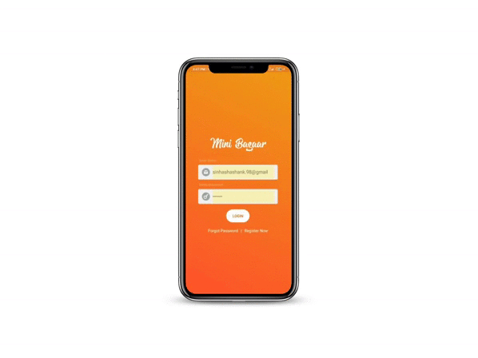

# Mini-Bazaar

This is a general ordering application with material design pattern using firebase as backend.

- Authentication - [Firebase Authentication](https://firebase.google.com/docs/auth/android/email-link-auth)
- Database - [Cloud Firestore](https://firebase.google.com/docs/firestore/quickstart)
- Storage - [Cloud Storage](https://firebase.google.com/docs/storage/android/start)

For Paytm payment gateway integration, [click here](https://developer.paytm.com/docs/v1/android-sdk/)

 

 ## Application Flow
 

 | 1. Registration Process                |
 |-------------------------------------|
 || 
 
  
 
 | 2. Ordering Process                |
 |-------------------------------------|
 || 

 

## Features Integrated -
- App tour
- Email Verification
- Wishlist
- Cart
- Profile
- Order History
- Order Tracking
- Paytm Payment Gateway

 

## Features to be added -
- Notifications
- Feedback
- Product Reviews and Ratings
- About/Contact us
- Merchant side interface

 

## Important Libraries Used -
- [Lottie Android](https://github.com/airbnb/lottie-android)
- [Android View Animations](https://github.com/daimajia/AndroidViewAnimations)
- [Butter Knife](https://github.com/JakeWharton/butterknife)
- [Material Text Field](https://github.com/florent37/MaterialTextField)
- [Circle Image View](https://github.com/hdodenhof/CircleImageView)
- [Fancy Dialog](https://github.com/geniusforapp/fancyDialog)
- [Toasty](https://github.com/GrenderG/Toasty)
- [KProgressHUD](https://github.com/Kaopiz/KProgressHUD)
- [Dexter](https://github.com/Karumi/Dexter)
- [Android Image Cropper](https://github.com/ArthurHub/Android-Image-Cropper)
- [Image Slide Show](https://github.com/denzcoskun/ImageSlideshow)
- [Fading TextView](https://github.com/rosenpin/fading-text-view)
- [Glide](https://github.com/bumptech/glide)
- [Picasso](https://github.com/square/picasso)
- [TapTargetView](https://github.com/KeepSafe/TapTargetView)
